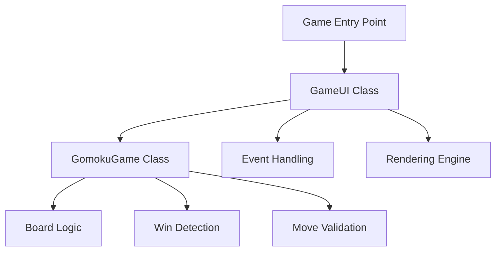
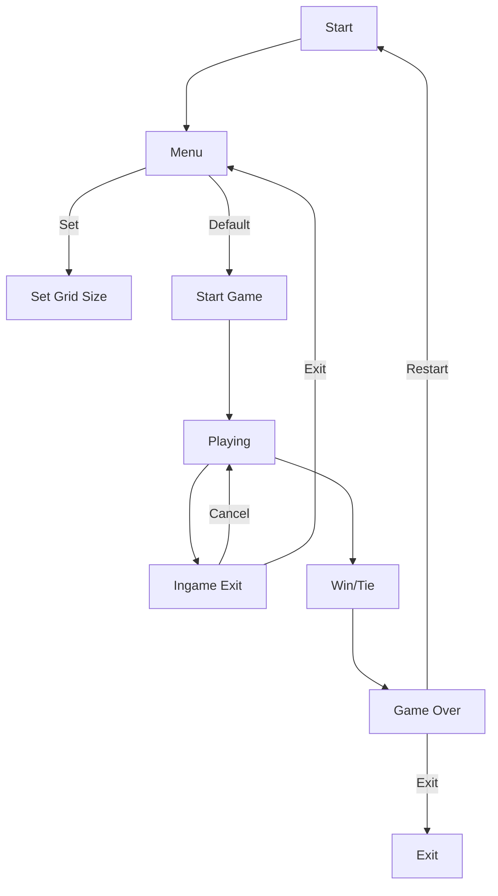
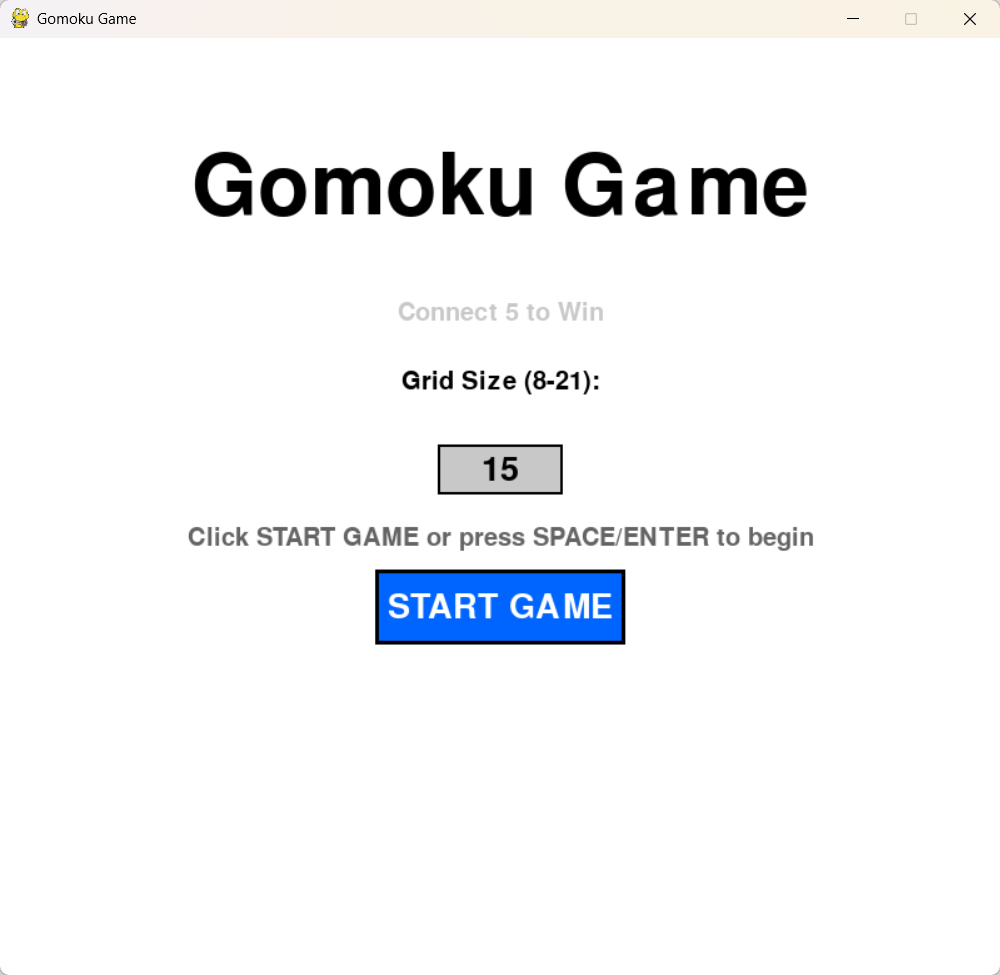
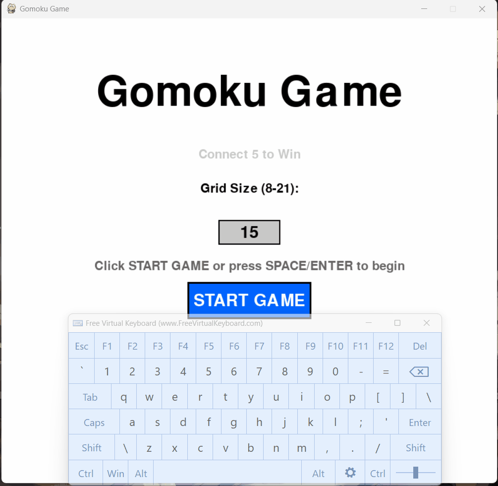
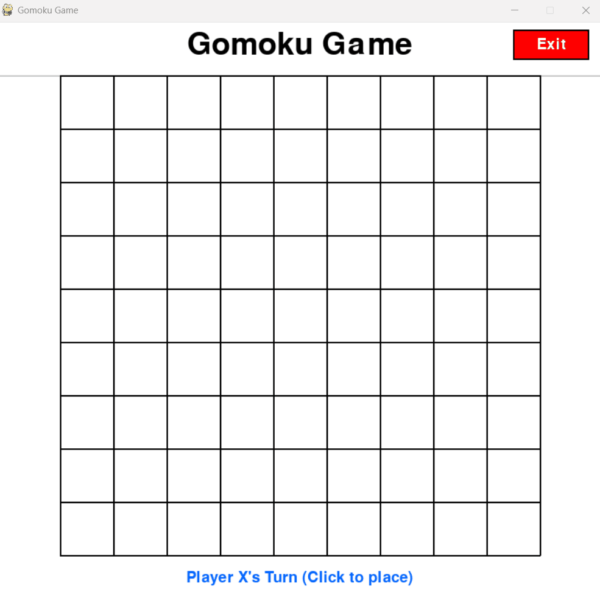
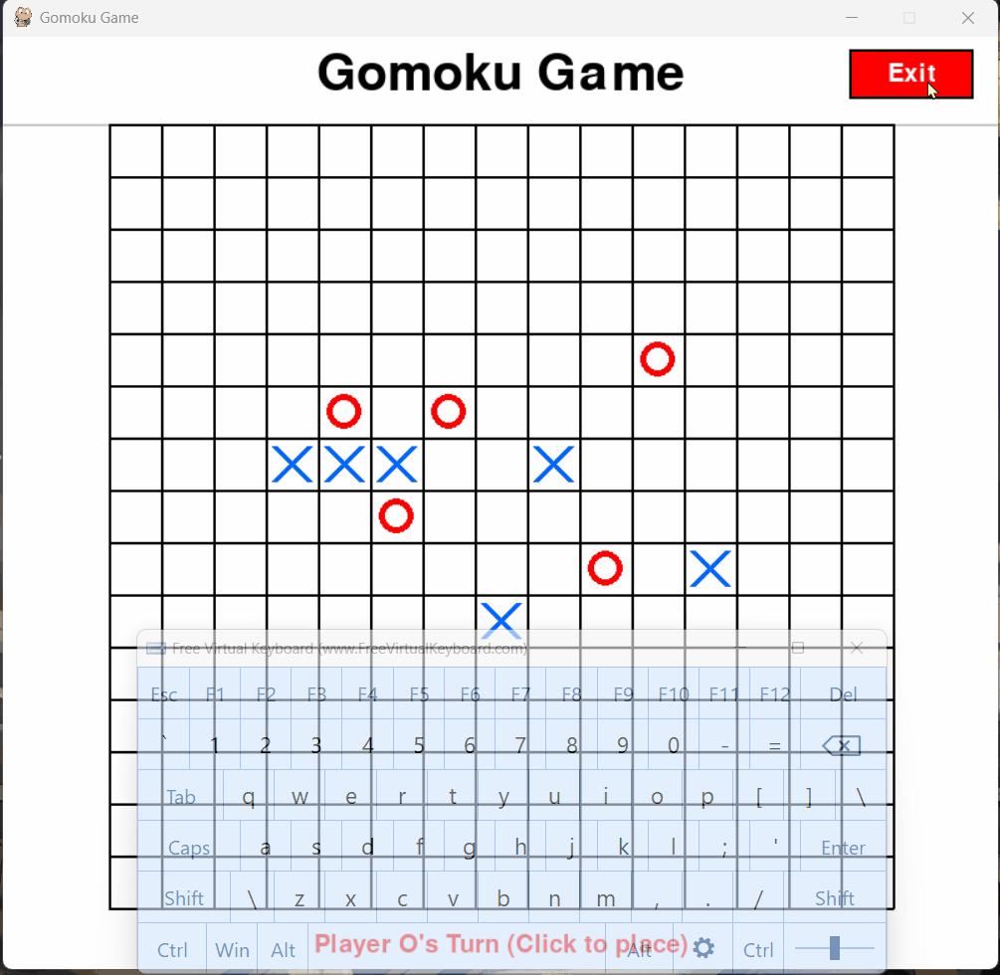
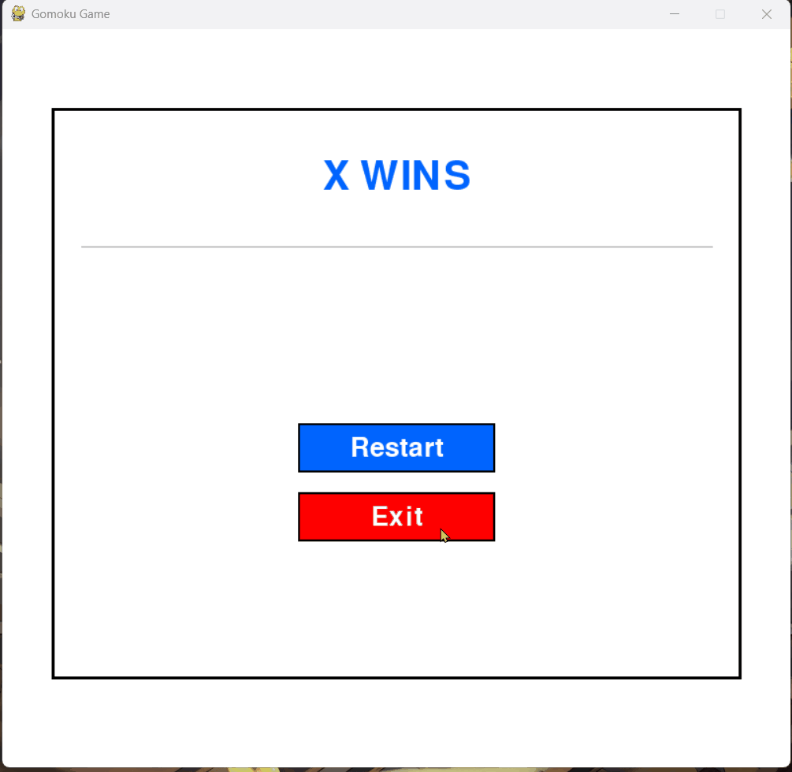
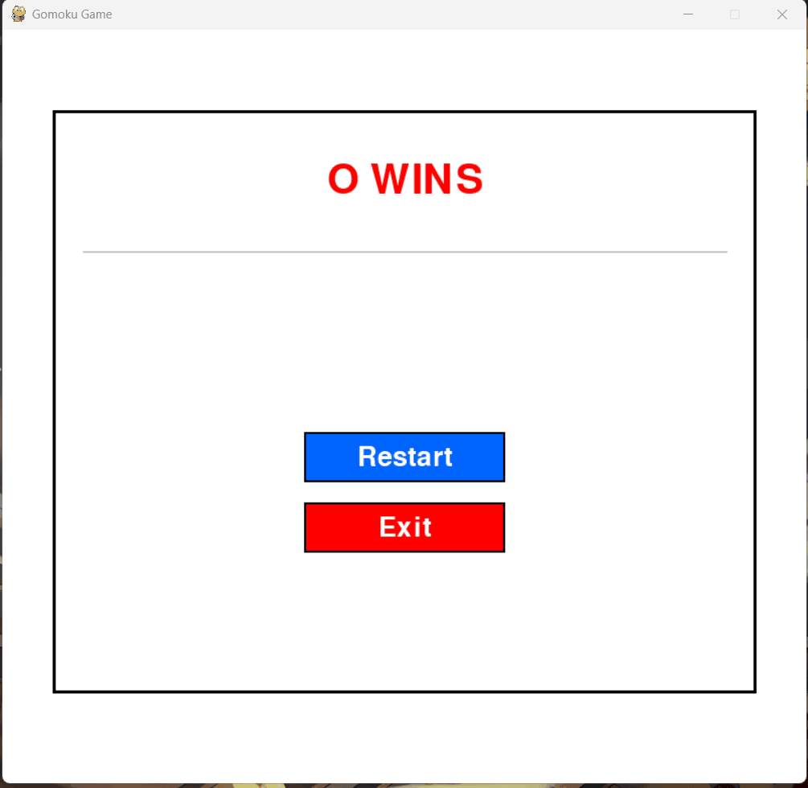

<div style = "font-family: Lato">

# Gomoku Game

Date: 2026/04/08
Author: Ziqian Xu

## 1. Problem Description

Gomoku (Five in a Row) is a classic two-player strategy board game where players alternately place pieces on a grid, aiming to be the first to achieve five consecutive pieces horizontally, vertically, or diagonally.

**Key Challenges:**
- Accurate win detection in 8 directions
- Responsive and intuitive user interface
- Customizable board sizes (8×8 to 21×21)
- Smooth game state management (menu, playing, game over)

## 2. Plan Design

### 2.1 Overall Architecture




### 2.2 Game States

| State | Description |
|-------|-------------|
| MENU | Main menu, grid size selection |
| PLAYING | Active gameplay |
| GAME_OVER | Display winner/result |
| CONFIRM_EXIT | Exit confirmation dialog |

### 2.3 Workflow
Flowchart as follow.


## 3. Code Module and Function Description

### 3.1 Constants and Enums

```python
# Game constants
WINDOW_SIZE = 800          # Window width
BOARD_HEIGHT = 630         # Board area height
TOTAL_HEIGHT = 750         # Total window height
WIN_LENGTH = 5             # Pieces needed to win

# Enums for state management
class GameState(Enum): MENU, PLAYING, GAME_OVER, CONFIRM_EXIT
class Player(Enum): EMPTY, X, O
```

### 3.2 GomokuGame Class (Core Logic)

| Method | Description |
|--------|-------------|
| `__init__()` | Initialize board and game state |
| `make_move(row, col)` | Place piece, check win/ tie, switch turns |
| `check_winner(row, col)` | Verify if last move creates a win |
| `_check_line()` | Check specific direction for 5 in a row |
| `is_board_full()` | Detect tie game |
| `reset_game()` | Reset board for new game |
| `get_position_from_mouse()` | Convert screen coordinates to board position |

### 3.3 GameUI Class (User Interface)

| Method | Description |
|--------|-------------|
| `draw_menu()` | Render main menu with input box |
| `draw_board()` | Draw grid, pieces, and hover highlight |
| `draw_game_over()` | Display winner and action buttons |
| `draw_confirm_exit()` | Show exit confirmation dialog |
| `draw_hover_highlight()` | Highlight empty cell under cursor (yellow) |
| `highlight_winning_line()` | Mark winning pieces (green) |
| `handle_click()` | Process mouse input for all states |
| `handle_key()` | Process keyboard shortcuts |
| `run()` | Main game loop (60 FPS) |

### 3.4 Key Algorithms

**Win Detection Algorithm:** (Pseudo-code)
```
For each of 4 directions (horizontal, vertical, diagonal):
    Count consecutive pieces in positive direction
    Count consecutive pieces in negative direction
    If total count ≥ WIN_LENGTH:
        Store winning line
        Return True
```

**Board Centering:**
```python
board_left = (WINDOW_SIZE - grid_size × CELL_SIZE) // 2
board_top = 70
```

## 4. Final Effect

### 4.1 Visual Features

| Feature | Effect |
|---------|--------|
| Main Menu | Centered title, grid size input (8-21), start button |
| Game Board | Grid lines, blue X pieces, red O pieces |
| Hover Highlight | Yellow transparent overlay on empty cells |
| Win Highlight | Green border on winning pieces |
| Turn Indicator | Shows current player at bottom |
| Exit Button | Red button in top-right corner |

### 4.2 Interactive Features

- Mouse Click: Place pieces, navigate menus
- Keyboard Shortcuts: Space/Enter (start)
- Input Validation: Grid size limited to 8-21
- Exit Confirmation: Prevents accidental exits

### 4.3 Game Screens

**Main Menu:**



You can set the grid size on your own, the grid size is expected to be no less than 8 and no greater than 21. The grid size is 15 by default.



**Game Screen:**

A real-time align check is performed to ensure the game ends properly.



**Ingame Exit:**

Press "Cancel" to resume the game, press "Exit" to return to the menu.



**Game Over:**

If you press "Exit", then the game will exit in 200ms.



If you press "Restart", then the game will return to the main menu.



### 4.4 Performance Metrics

| Aspect | Specification |
|--------|---------------|
| Grid Sizes | 8×8 to 21×21 |
| Window Size | 800×750 pixels |
| File Type | Standalone EXE |
| Dependencies | None (packaged) |


## 5. Conclusion

The Gomoku game successfully implements a complete two-player experience with:
- Intuitive mouse-driven interface
- Accurate win detection in all directions
- Flexible board sizing (8-21)
- Visual feedback (hover, win highlighting)
- Robust state management
- Standalone executable for easy distribution

The project demonstrates effective use of object-oriented programming, event-driven architecture, and Pygame's rendering capabilities to create a polished, playable game.

</div>